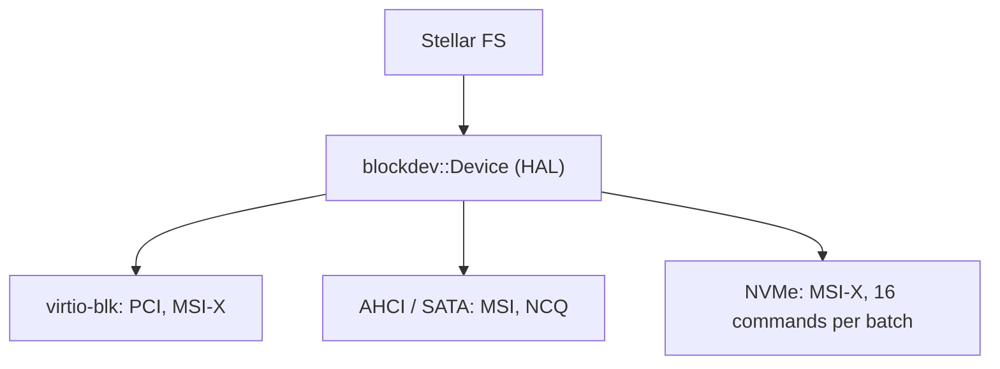

# Architecture

How the kernel is built today. For where it is going, see the [README](../README.md).

## The "Cosmos" naming model

Every subsystem shares one naming scheme instead of generic OS-dev vocabulary, and the
metaphor maps onto the real mechanics:

| Subsystem | Term | Meaning |
|---|---|---|
| Physical memory | **Universe** | Buddy allocator (`mm/pmm.cpp`) |
| | Galaxy / Orbit / Planet | A firmware-reported region / one buddy free list / one allocated block |
| Virtual memory | **Constellation** | An address space (one PML4); *The Core* is the kernel's own |
| Scheduler | **Orbital** | MLFQ scheduler (`sched/orbital.cpp`) |
| | Sun / Satellite / Orbit | A core / a kernel thread / a priority ring (4 of them) |
| Filesystem | **Stellar FS** | Graph-based COW filesystem (`fs/stellar.cpp`) |
| | Star / Constellation | Any object (file or directory) / a directory |

### Boot sequence

```mermaid
flowchart LR
  A["Limine hands off"] --> B["GDT / TSS / IDT"]
  B --> C["Universe: buddy allocator"]
  C --> D["The Core: own page tables, CR3 switch"]
  D --> E["x2APIC or xAPIC"]
  E --> F["ACPI MADT, IOAPIC, keyboard"]
  F --> G["Block drivers and Stellar FS"]
  G --> H["Reclaim bootloader memory"]
  H --> I["Wake APs"]
  I --> J["Orbital scheduler"]
```

### Memory

**Physical (`Universe`).** Real buddy split and coalesce, spinlock-protected so every core
can allocate concurrently.

**Virtual (`Constellation`).** The Core is built fresh instead of continuing on Limine's
tables (`mm/vmm.cpp`): reusing bootloader-reclaimable memory before replacing the tables that
point into it is a real use-after-free.

### Scheduler (Orbital)

A Satellite that burns its whole timeslice is demoted one ring; one that yields early is
promoted one ring. Context switching lives in `sched/context_switch.asm` + `orbital.cpp`;
preemption comes off the APIC timer, calibrated against the PIT at boot.

**Each Sun has its own four-ring run queue and lock.** A Sun with nothing local scans the
others (never holding its own lock) and steals the highest-priority ready Satellite.
`spawn()` enqueues locally, so new work starts local and idle Suns pull it away.

Finished Satellites (entry returns, or `exit_current()`) go on a global zombie list and have
their stacks freed by whichever Sun idles next, so a Sun pinned by a CPU-bound Satellite
doesn't block reaping.

### Storage: one HAL, three drivers

The HAL is a small virtual interface (`read_sector`, `write_sector`, batched variants, `flush`,
`capacity_sectors`). `flush` is a virtio FLUSH request, AHCI FLUSH CACHE EXT, or an NVMe Flush. Probe order is virtio-blk → AHCI → NVMe; the first that finds a disk
registers.

| Driver | Details |
|---|---|
| **virtio-blk** | Full modern virtio-pci transport (capability parsing, reset → ACK → DRIVER → FEATURES_OK → DRIVER_OK, only `VIRTIO_F_VERSION_1`), split virtqueue, MSI-X completion, 16 requests in flight |
| **AHCI / SATA** | Found by PCI class, port rebase, IDENTIFY, READ/WRITE DMA EXT, NCQ batches, MSI completion |
| **NVMe** | Admin + I/O queue pair, IDENTIFY, MSI-X (MSI fallback), PRP1 transfers through bounce buffers, 16 commands per batch |

All three wait with `cli` / check / `sti; hlt` (no lost-wakeup window) and fall back to
polling if no interrupt arrives.

### Locking

`orbital::Mutex` is recursive and owned by the Satellite. A contended waiter calls `yield_contended()`, which
puts it in the lowest ring: plain `yield()` promotes a Satellite, so waiters used to climb above the lock holder
and starve it (see [Engineering notes](ENGINEERING.md), item 20). Stellar has one mutex and each block driver has
its own around every request, always acquired in that order. There is no sleeping lock or wait queue yet.

### Clock

`clock` (`drivers/clock.cpp`) gives the filesystem its `mtime`. It reads the CMOS RTC once after ACPI is up and
again just before the scheduler starts (the filesystem self-tests run for seconds first), then adds a tick counter
that only the boot core's APIC timer advances, 10 ms per tick. `now_ms()` is Unix milliseconds, or 0 if the RTC is
unreadable or reports an invalid time, so a missing clock looks the same as before. The RTC is assumed to be UTC and
in 2000 to 2099. Date math lives in `civil.hpp` so the host suite tests it.

Resolution is one second until the scheduler starts and 10 ms after. Ticks are lost while interrupts are masked
(the drivers do this in polled mode), so the clock can run slow, never fast; every boot re-reads the RTC, which
bounds the error. A TSC-based clock would not lose ticks, but APs do not necessarily start with synchronised
counters and Satellites migrate between cores, so it is not used.

### Hardware and interrupts

x2APIC with xAPIC fallback. ACPI/MADT parsing for CPUs, IOAPIC and Interrupt Source
Overrides. The PS/2 keyboard on IRQ1 is resolved to its real GSI and polarity/trigger flags;
Shift/Ctrl/Alt are tracked on both sides and E0-prefixed keys (arrows, Home/End, Insert/Delete,
Page Up/Down) are emitted as ANSI CSI sequences.

---
