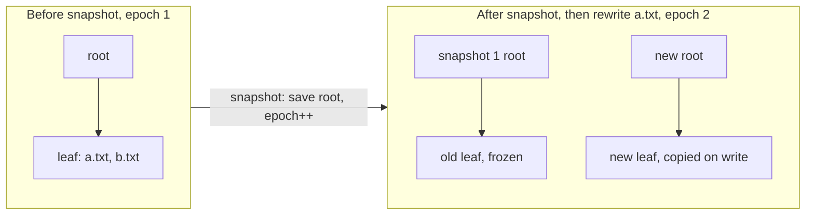

# Stellar FS

`kernel/src/fs/stellar.cpp`. A `Constellation` (directory) is a star whose data is a chain of
edge sectors (7 per sector, unbounded), so one star can be linked from several directories
with no hard-link special case.

```text
sector 0          superblock: magic, version 4, catalog root, next star id, epoch, snapshot table
sectors 1..n      free-sector bitmap
sectors n+1..     B+tree nodes (1 sector each), directory sectors, file extents
```

The **catalog** is a disk-backed B+tree keyed by 64-bit star ID (leaf fanout 10, internal
fanout 30). Files are one contiguous extent with a CRC32 in the catalog entry.

### O(1) snapshots via epoch copy-on-write

The superblock holds a global `epoch`. Every catalog node, directory sector and file extent
records the epoch it was written in, and may be modified **in place only if that equals the
current epoch**; otherwise it is copied first (path-copied up to the root for the catalog).



`snapshot()` is three steps: record `{catalog_root, epoch}` in the snapshot table, `epoch++`,
write the superblock. **One sector write, no reads, regardless of tree size**: everything that
existed is now older than the current epoch and becomes copy-on-write on its next change.

A snapshot is a *view*: `find`, `list`, `read_file` and `verify_file` take an optional snapshot
ID (`stellar::LIVE` = 0 is the default), and star IDs are stable across views.

- **File rewrites** allocate a fresh extent. The old one is freed immediately if it was born in
  the current epoch (no snapshot can reference it) and retained if older. Rewriting one file
  300 times with no snapshot in between costs no net space.
- **First write after a snapshot** costs O(log n) node copies in the catalog, and for a directory
  copies that directory's sector chain: O(directory size), the same order as the linear scan every
  directory operation already does.

### I/O efficiency

Three things were making the filesystem slow, all fixed: the whole free bitmap was rewritten on
*every* allocation; there was no sector cache, so every B+tree level was a disk round trip; and the
superblock was written for every new star ID. Now only dirty bitmap sectors are written, once per
operation; a 64-slot write-through cache (32 KiB) serves repeat reads; allocation is next-fit with
whole-byte skipping.

Measured with the host-side harness (131072-sector disk), old implementation vs new in the same harness:

| Operation | Before | After |
|---|---:|---:|
| `create_file` into a directory (avg of 100) | 52.8 writes, 12.1 reads | **6.7 writes, 0.4 reads** |
| Snapshot of a ~120-entry tree | 3,999 writes, 2,742 reads | **1 write, 0 reads** |
| Snapshot of a 700+ entry tree with a 5-deep subtree | recursive copy, grows with size | **1 write, 0 reads** |
| NVMe interrupts during boot self-tests | 271 | **16** |

---

---

## Known limitations

Stated plainly:

- **Not crash-consistent.** Data is written before the superblock, but nodes modified in place
  within an epoch are not atomic, there is no journal, and no block-device FLUSH is issued. The
  persistence checked so far is a clean QEMU reboot, not a pulled plug.
- **No deletion** of files, directories or snapshots, so blocks retained by snapshots are never
  reclaimed. The snapshot table holds 24.
- Snapshots are **whole-filesystem**, not per-subtree.
- Directory lookup is a linear scan of the sector chain.
- Free space is a linear bitmap, not the Universe/Orbit buddy machinery.
- Per-file CRC32 only; no per-extent or per-node checksums.
- Bumping the superblock version reformats an existing disk on next boot (v3 images aren't migrated).
- The boot self-tests that take snapshots are skipped on a mounted disk to avoid exhausting the table.

---
