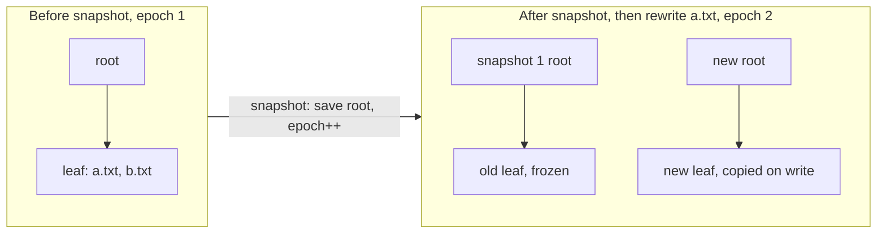

# Stellar FS

`kernel/src/fs/stellar.cpp`. A `Constellation` (directory) is a star whose data is a copy-on-write
B+tree of edges keyed by name hash, so one star can be linked from several directories
with no hard-link special case.

```text
sectors 0 and 1   twin superblocks: magic, version 7, commit number, epoch, catalog root, next star id, snapshot table
sectors 2..n      free-sector bitmap
sectors n+1..     B+tree nodes (1 sector each), directory sectors, file extents
```

The **catalog** is a disk-backed B+tree keyed by 64-bit star ID (leaf fanout 7, internal
fanout 30). Files are one contiguous extent with a CRC32 in the catalog entry.

### O(1) snapshots via epoch copy-on-write

The superblock holds a global `epoch`. Every catalog node, directory sector and file extent
records the epoch it was written in, and may be modified **in place only if that equals the
current epoch**; otherwise it is copied first (path-copied up to the root for the catalog).



`snapshot()` is three steps: record `{catalog_root, epoch}` in the snapshot table, `epoch++`,
write the superblock. **One sector write, no reads, regardless of tree size**: everything that
existed is now older than the current epoch and becomes copy-on-write on its next change.

A snapshot is a *view*: `find`, `list`, `read_file` and `verify_file` take an optional snapshot
ID (`stellar::LIVE` = 0 is the default), and star IDs are stable across views.

- **File rewrites** allocate a fresh extent. The old one is freed immediately if it was born in
  the current epoch (no snapshot can reference it) and retained if older. Rewriting one file
  300 times with no snapshot in between costs no net space.
- **First write after a snapshot** costs O(log n) node copies in the catalog and O(log n) in the
  directory being written.

### Deletion and reclamation

Each catalog entry carries a link count. `unlink(dir, name)` removes one edge; the star dies when
its last edge goes, and a non-empty directory is refused. A dead star's extents are returned
immediately if they were born in the current epoch, because no snapshot can reference them.
Anything older stays allocated for the snapshots that may still use it.

`delete_snapshot(id)` tombstones a slot in the snapshot table, and the next `snapshot()` reuses it.
Space is reclaimed by `gc()`, a stop-the-world mark and sweep: it marks the metadata region plus
every catalog node, directory node and file extent reachable from the live root and from each
remaining snapshot root, then rewrites the free bitmap to match. Nothing reachable can be freed,
and sectors leaked by failed operations are recovered as a side effect. It is O(filesystem size) and works in
windows of at most 16 MiB of mark bitmap (64 GiB of disk), see [Free-space bitmap](#free-space-bitmap).

### I/O efficiency

Three things were making the filesystem slow, all fixed: the whole free bitmap was rewritten on
*every* allocation; there was no sector cache, so every B+tree level was a disk round trip; and the
superblock was written for every new star ID. Now only dirty bitmap sectors are written, once per
operation; a 256-slot write-through cache (128 KiB) serves repeat reads; allocation is next-fit with
whole-byte skipping in both directions.

Measured with the host-side harness (131072-sector disk), old implementation vs new in the same harness:

| Operation | Before | After |
|---|---:|---:|
| `create_file` into a directory (avg of 100) | 52.8 writes, 12.1 reads | **6.7 writes, 0.4 reads** |
| Snapshot of a ~120-entry tree | 3,999 writes, 2,742 reads | **1 write, 0 reads** |
| Snapshot of a 700+ entry tree with a 5-deep subtree | recursive copy, grows with size | **1 write, 0 reads** |
| NVMe interrupts during boot self-tests | 271 | **16** |

### Second pass

- **Extents move in batches.** Writes send every whole sector in one batched request and only the
  padded tail sector singly. `read_file` and `verify_file` batch the same way, and a read no longer
  needs an output buffer rounded up to a sector.
- **Group commit.** `begin_batch()` / `end_batch()` hold the bitmap and superblock writes until the
  outermost batch ends. Data and catalog nodes are still written through immediately, so a crash
  inside a batch loses more than a crash between single operations.
- **CRC32 is slice-by-8**, checked against the bitwise reference at every length and alignment.
- **The cache is 256 slots**, so B+tree interior nodes survive a directory walk.

## On-disk format v7

```text
sectors 0 and 1   twin superblocks: magic, version 7, commit number, epoch, catalog root, next star id,
                  feature flags, snapshot table, CRC32 in the last 4 bytes
sectors 2..n      free-sector bitmap, 508 bytes of bits per sector plus a CRC32
sectors n+1..     catalog nodes, directory nodes (each ending in a CRC32), file extents
```

Every metadata sector ends in a CRC32 of the sector, verified on every read from disk and stamped on every
write; file data keeps its own CRC32 in the catalog. Catalog entries are 56 bytes (type, checksum, size, extent,
generation, link count, `mtime`, `flags`, one reserved word), so a leaf holds 7. Feature flags in the superblock
gate future layout additions: an unknown *incompatible* bit refuses to mount (`Unsupported`), compatible bits are
ignored. `FLAG_EXTENT_TABLE` (bit 0 of a star's flags) is reserved for extent-list files and is not used yet. A v5
disk is reformatted on the next boot, as with earlier bumps.

## Crash consistency

A commit is the only thing that makes anything durable, and it is ordered:

1. every data extent and metadata node was already written (but is not yet durable), along with any bitmap page
   the cache had to write early;
2. **flush**;
3. write the dirty bitmap sectors; **flush**;
4. write the new superblock to the slot *not* holding the current one, with a higher commit number; **flush**;
5. only now free the sectors the commit replaced, and write that bitmap update (best effort).

Every commit starts a new epoch, so a node that has been durable is never modified in place: it is copied, and the
old copy is freed according to when it was born. Born in the current epoch (never durable) means free it now;
born earlier, with no snapshot taken since, means free it after the next commit succeeds; otherwise a snapshot may
still see it and it is kept until `gc()`. The on-disk bitmap is therefore always a superset of what the durable
superblock references, so a crash can leak space (which `gc()` or a damaged-mount rebuild reclaims) but can never
hand out a sector that is still in use.

Mount takes the valid superblock with the higher commit number. If a superblock slot or a bitmap sector fails its
checksum, the bitmap is rebuilt from the trees before the filesystem is used. A failed operation that changed
anything is **rolled back** by reloading the durable state, so it leaves no partial result; a failure inside a
`begin_batch`/`end_batch` group rolls the whole group back, and `end_batch` reports it. A group that only contained
validation failures (`Exists`, `NotFound`, ...) is not affected.

**How this is tested.** The host harness records every sector write and flush barrier of a random 64-operation
workload (creates, rewrites, unlinks, links, snapshots, `gc`, batches). At every cut point it builds disks from a
random subset of the writes issued since the last barrier, applied in random order and sometimes with one of them
replaced by garbage (a torn write), mounts each, and requires that the result is exactly the state before or after
the operation that was in flight, that `check()` finds nothing wrong, and, for a fifth of them, that `gc()`, a new
write and a remount all work. The default run covers about 6000 states. Deliberately wrong protocols are rejected:
writing the bitmap after the superblock fails over a thousand of 2900 states; starting no new epoch, freeing
replaced sectors immediately, and making `flush()` a no-op each fail the suite.

**Assumptions.** A single 512-byte sector write is either applied or not, or is detected by its CRC if torn; the
device honours `flush()`. Not modelled: a device that acknowledges a flush without making the data durable, and
silent corruption that happens to preserve a CRC.

## Verification and hardening

`check(report, deep)` walks the live tree and every snapshot and reports bad checksums, bad file data, referenced
sectors the bitmap says are free (the dangerous case), leaked sectors, wrong link counts, dangling or malformed
directory entries, sectors referenced twice, and malformed nodes. Reads also defend themselves against stale or
wrong structure that a CRC cannot catch: node entry counts are bounded, sector numbers must lie in the data area,
and directory trees and tree recursion have cycle and depth limits. Those limits were added after mutation testing
of the crash harness produced a stack overflow from a cyclic tree.

## Directory tree

A directory is a copy-on-write B+tree stored in the same kind of sectors as the catalog and under the same
epoch rule: a node is modified in place only if it was born in the current epoch, otherwise it is copied and the
copy is linked in along the path to the root. A directory star's catalog entry holds the tree root in
`first_sector` and its parent directory in `size_bytes` (`stat` reports 0 for directories); the root directory's
parent is `INVALID_STAR`. The parent pointer is what lets a later `rename` refuse to move a directory under its
own descendant without walking the subtree.

**Keys.** An entry is `(key, star, name[52])`, 68 bytes, 7 per leaf; internal nodes are the catalog's, 30-way.
The key is the top 48 bits of the name's hash followed by a 16-bit ordinal, so keys are unique and all names with
the same 48-bit prefix sit next to each other. A lookup seeks to the first key with that prefix and compares real
names along the run, so a hash collision can never return a wrong answer; creating a name takes the lowest free
ordinal in its run. A run can hold 65536 names, after which a create reports `NoSpace`. The hash (FNV-1a with a
final mix) is now part of the on-disk format and is not keyed, so a determined user can build colliding names.
Listings come out in hash order.

**Cost.** Lookups, creates and unlinks descend one path. With fanouts of 7 and 30 the tree is 3 levels at 1000
entries and 4 at around 100,000 (computed from the fanouts, not measured). The first write after each commit copies that path, not the directory. Measured in the host
harness, a single-operation create (one commit each) costs 10.5, 13.4 and 13.6 sector writes into directories of
100, 400 and 1000 entries; the chain it replaced cost 25.9, 70.7 and 156.7. Snapshot views use the same lookup, so
there is no per-snapshot filter and no RAM index, and no directory operation allocates RAM.

**Delete.** An unlink removes the entry from its leaf. A leaf that becomes empty is removed from its parent and
its sector returned under the usual epoch rule; an internal node left with one child is collapsed at the root.
Nodes are not merged when they are merely sparse, so a directory that once held many entries keeps a few sparse
nodes. A completely empty directory is a single empty leaf.

`check()` walks every directory tree with key bounds (every key must lie between its parent's separators and be
strictly ascending), verifies each key's prefix against its name's hash, each entry's target, and each
subdirectory's parent pointer, and counts the edges that feed the link-count check.

## Status codes

Every operation that can fail takes an optional trailing `Status* why`. The return value keeps its old shape
(`bool`, a star ID or `INVALID_STAR`), and `*why` says which of these happened: `NotMounted`, `NotFormatted`,
`InvalidArgument`, `InvalidName`, `NotFound`, `Exists`, `NotADirectory`, `IsADirectory`, `NotEmpty`,
`NoSpace`, `NoMemory`, `Io`, `Checksum`, `Corrupt`, `Busy`, `NoSuchSnapshot`, `TooManySnapshots`, `Unsupported`, `WouldCycle`. `Internal`
means a failure path forgot to say why; the tests assert it never appears. It is an out-parameter rather than
the return type because `Ok` is 0, so a function returning `Status` would silently invert every existing
`if (!unlink(...))`.

`read_file` returns `READ_ERROR` (`INVALID_STAR`) on failure. `0` now only means a legitimately empty read, and
a checksum mismatch is `READ_ERROR` with `Checksum`. Names must be 1 to 51 bytes with no `/`, and `.` and `..`
are refused; duplicates are refused with `Exists`.

`resolve("/a/b/c")` walks a path from the root in any view, and `resolve_parent` splits a path into the parent
directory and a validated leaf name. Repeated and trailing slashes are accepted (a trailing slash requires a
directory), and relative paths, `.` and `..` are refused because directories keep no parent pointer.

## Rename

`rename(src_dir, src_name, dst_dir, dst_name, flags)` and `rename_path(from, to, flags)` move an entry between
names and directories in one transaction, so a crash leaves the old name or the new one and never both or neither.
The star keeps its ID, size, link count and `mtime`; only the edge moves. Snapshots keep showing the old name where
it was.

- **Replacing.** If the destination exists it is replaced atomically. A file replaces a file, a directory replaces
  an *empty* directory; a file over a directory is `IsADirectory`, a directory over a file `NotADirectory`, over a
  non-empty directory `NotEmpty`. The replaced star goes through the same death-or-link-count path as `unlink`, so
  replacing one of two hard links leaves the other intact. `RENAME_NOREPLACE` turns any existing destination into
  `Exists`.
- **No-ops.** Renaming a name onto itself, or onto another name of the same star, succeeds and changes nothing.
- **Cycles.** Moving a directory into itself or any descendant is `WouldCycle`. The check walks the destination's
  parent pointers up to the root, so it costs the depth of the destination, not the size of the moved subtree. A
  moved directory's parent pointer is rewritten in the same transaction, and `check()` verifies it.
- A rename does not update the `mtime` of either directory.

## Free-space bitmap

The on-disk bitmap is unchanged: one bit per sector, 508 bytes of bits plus a CRC32 per sector ("page", 4064
sectors of disk each). What changed is that it is no longer held in RAM.

- **Page cache.** 64 slots (32 KiB). Dirty pages stay in a slot until the commit writes them; if one transaction
  dirties more pages than there are slots, the least recently used dirty page is written early. That is safe for
  the crash model: RAM never clears a bit the durable state references before the commit (those frees are
  deferred), so any page image is a superset of what is durable and the worst outcome of a crash is a leak that
  `gc()` recovers. Early writes need a group commit or a very large file; a single create dirties about as many
  pages as the extent spans (a 40 MiB file: 20 pages). The commit flushes the device if any early write happened.
- **Summary.** A 16-bit count of free data sectors per page, built while mounting and kept exact by every
  allocate and free. Allocation skips full pages without reading them and takes a completely free page without
  reading it either, so a fresh disk is searched without touching the bitmap. `free_space_sectors()` sums the
  counts. RAM is 3 bytes per page, 1.5 MiB per TB.
- **Batched I/O.** Mount and `format` move the bitmap 32 sectors per device command, with a fallback to single
  reads. `gc()` and `check()` read it through a streaming reader that prefers a cached (possibly dirty) page and
  does not disturb the cache.
- **Windowed gc.** The mark bitmap covers at most 16 MiB at a time (64 GiB of disk); a larger disk is processed in
  windows, re-walking the trees for each one. A disk of up to 64 GiB is one window, as before.
- **Damaged pages.** A page failing its checksum at mount is flagged, counted as free, and rebuilt by the gc that
  mount runs; it is rewritten even when its rebuilt contents are all zero.

Measured with `make bench-stellar` on sparse virtual disks (host RAM disk, so device commands are the figure that
carries over; before is the fully resident bitmap):

| 8 GiB disk | Before | After |
|---|---:|---:|
| Bitmap RAM | 2,068 KiB | 61 KiB |
| `format` device commands | 4,137 | 140 |
| `mount` device commands | 4,131 | 132 |
| `free_space_sectors()` (one call) | 16 ms | a few microseconds |
| `gc()` device commands | 96 | 229 |
| `check()` device commands | 22 | 151 |

`gc` and `check` now read the bitmap, which they did not have to when it was resident, so their command counts went
up; the first version of this change did that one page per command (4,226 and 4,087) and the streaming reader is what
brought it back. Extrapolated linearly to 1 TB, the resident bitmap would have been 258 MiB plus another 258 MiB for
a gc mark; now it is 1.5 MiB plus the 32 KiB cache.

**How it is tested.** The same randomized workload on a 40,000-sector disk, run with a 64-slot cache, a 1-slot
cache, and a 2-slot cache with 1-page gc windows, produces byte-identical disk images. The crash exploration has a
fourth configuration (a 3-page disk with a 1-slot cache, 2,650 crash states) in which early writes really happen.
A 2 GiB disk takes five 40 MiB files in one group commit (38 early writes), remounts, and windowed gc runs over
eleven windows. Mount is tested against an unreadable bitmap sector, failing batched reads, and a damaged page that
holds only free space. Every one of five mutations (dropping a dirty page on eviction, a wrong free-page shortcut, a
summary that forgets frees, a gc window offset error, and a damaged page that is not forced to rewrite) fails the
suite.

## Mount and format policy

`mount()` never formats. The kernel formats a disk only when `mount()` reports `NotFormatted` **and**
`can_auto_format()` agrees: the first 64 sectors are all zero, or sector 0 or 1 carries the Stellar magic (an
older on-disk version, which is reformatted on purpose). Every other outcome (`Corrupt`, `Unsupported`, `Io`, a
disk holding someone else's data) leaves the disk untouched and boots without a filesystem. The block-device
self-tests that write the last 64 sectors only run when a Stellar volume is mounted and stops short of them. The
probe looks at the first 64 sectors only, so data that starts later on a disk whose first 32 KiB are zero is not
detected. `stellarfs mkfs` and `format()` are explicit calls and are not guarded.

## Concurrency

Every public function takes one recursive `orbital::Mutex` (owned by the Satellite, not the core), and
`begin_batch` holds it until `end_batch`, so one thread's group commit cannot interleave with another's.
`mount` and `format` refuse to run while a batch is open. Each block driver has its own mutex around its HAL
entry points, always taken after Stellar's. There are no sleeping locks yet: a contended waiter yields and
sinks to the lowest scheduler ring so a runnable holder always outranks it.

---

## Known limitations

Stated plainly:

- Crash safety rests on the assumptions listed above; it has been tested by simulation, not on hardware.
- **gc() is stop-the-world**, O(filesystem size): it holds the filesystem lock for its whole run. Space held
  by older epochs only comes back via `delete_snapshot` and `gc()`. On a disk over 64 GiB it walks the catalog
  once per window (and once per snapshot root per window), so cost grows with disks x snapshots x catalog size.
- Dead stars keep a 56-byte catalog entry and their IDs are never reused; the B+tree has no delete.
- A deleted snapshot's ID can be handed out again by a later `snapshot()`. The snapshot table holds 24.
- Snapshots are **whole-filesystem**, not per-subtree.
- Directory nodes are not merged on delete, only dropped when empty, and a name hash prefix holds at most 65536
  names. Directory listings are in hash order, not creation order.
- Dead stars cost catalog space: 6000 create/unlink pairs grew the catalog by about 1600 sectors in the host
  harness, while 6000 link/unlink pairs of one file cost nothing.
- `read_file` can only verify the checksum when the whole file is read; partial reads are unchecked.
- Free space is a bitmap, not the Universe/Orbit buddy machinery. Mount reads all of it (in 32-sector commands)
  to build the page summary, so mount time is linear in disk size: about 130 commands per 8 GiB.
- `check()` still needs two disk-sized bit arrays plus 8 bytes per star in RAM (about 0.5 GiB per TB of disk), so
  on very large disks run it with the host `stellarfs fsck`, not in the kernel.
- A failure to read a bitmap page while *freeing* sectors is not reported to the caller: the sectors stay marked
  used (a leak that `gc()` recovers) and the first error is kept for the next call that does report.
- Per-file CRC32 only; no per-extent or per-node checksums.
- Bumping the superblock version reformats an existing disk on next boot (v3 to v6 images aren't migrated).
- The boot self-tests that take snapshots are skipped on a mounted disk to avoid exhausting the table.

---
