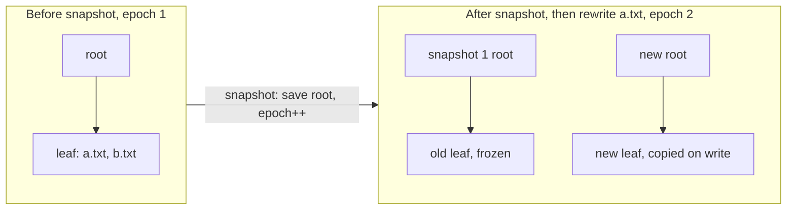

# Stellar FS

`kernel/src/fs/stellar.cpp`. A `Constellation` (directory) is a star whose data is a chain of
edge sectors (7 per sector, unbounded), so one star can be linked from several directories
with no hard-link special case.

```text
sectors 0 and 1   twin superblocks: magic, version 6, commit number, epoch, catalog root, next star id, snapshot table
sectors 2..n      free-sector bitmap
sectors n+1..     B+tree nodes (1 sector each), directory sectors, file extents
```

The **catalog** is a disk-backed B+tree keyed by 64-bit star ID (leaf fanout 7, internal
fanout 30). Files are one contiguous extent with a CRC32 in the catalog entry.

### O(1) snapshots via epoch copy-on-write

The superblock holds a global `epoch`. Every catalog node, directory sector and file extent
records the epoch it was written in, and may be modified **in place only if that equals the
current epoch**; otherwise it is copied first (path-copied up to the root for the catalog).



`snapshot()` is three steps: record `{catalog_root, epoch}` in the snapshot table, `epoch++`,
write the superblock. **One sector write, no reads, regardless of tree size**: everything that
existed is now older than the current epoch and becomes copy-on-write on its next change.

A snapshot is a *view*: `find`, `list`, `read_file` and `verify_file` take an optional snapshot
ID (`stellar::LIVE` = 0 is the default), and star IDs are stable across views.

- **File rewrites** allocate a fresh extent. The old one is freed immediately if it was born in
  the current epoch (no snapshot can reference it) and retained if older. Rewriting one file
  300 times with no snapshot in between costs no net space.
- **First write after a snapshot** costs O(log n) node copies in the catalog, and for a directory
  copies that directory's sector chain: O(directory size), the same order as the linear scan every
  directory operation already does.

### Deletion and reclamation

Each catalog entry carries a link count. `unlink(dir, name)` removes one edge; the star dies when
its last edge goes, and a non-empty directory is refused. A dead star's extents are returned
immediately if they were born in the current epoch, because no snapshot can reference them.
Anything older stays allocated for the snapshots that may still use it.

`delete_snapshot(id)` tombstones a slot in the snapshot table, and the next `snapshot()` reuses it.
Space is reclaimed by `gc()`, a stop-the-world mark and sweep: it marks the metadata region plus
every catalog node, directory chain and file extent reachable from the live root and from each
remaining snapshot root, then rewrites the free bitmap to match. Nothing reachable can be freed,
and sectors leaked by failed operations are recovered as a side effect. It is O(filesystem size)
and needs one bit of RAM per sector.

### I/O efficiency

Three things were making the filesystem slow, all fixed: the whole free bitmap was rewritten on
*every* allocation; there was no sector cache, so every B+tree level was a disk round trip; and the
superblock was written for every new star ID. Now only dirty bitmap sectors are written, once per
operation; a 256-slot write-through cache (128 KiB) serves repeat reads; allocation is next-fit with
whole-byte skipping in both directions.

Measured with the host-side harness (131072-sector disk), old implementation vs new in the same harness:

| Operation | Before | After |
|---|---:|---:|
| `create_file` into a directory (avg of 100) | 52.8 writes, 12.1 reads | **6.7 writes, 0.4 reads** |
| Snapshot of a ~120-entry tree | 3,999 writes, 2,742 reads | **1 write, 0 reads** |
| Snapshot of a 700+ entry tree with a 5-deep subtree | recursive copy, grows with size | **1 write, 0 reads** |
| NVMe interrupts during boot self-tests | 271 | **16** |

### Second pass

- **Directory appends are O(1).** A directory whose head sector is current has a current chain, so
  `dir_make_current` checks one sector instead of walking the chain, and `add_edge` resumes from the
  last sector it filled instead of the head. `unlink` drops that hint.
- **Extents move in batches.** Writes send every whole sector in one batched request and only the
  padded tail sector singly. `read_file` and `verify_file` batch the same way, and a read no longer
  needs an output buffer rounded up to a sector.
- **Group commit.** `begin_batch()` / `end_batch()` hold the bitmap and superblock writes until the
  outermost batch ends. Data and catalog nodes are still written through immediately, so a crash
  inside a batch loses more than a crash between single operations.
- **CRC32 is slice-by-8**, checked against the bitwise reference at every length and alignment.
- **The cache is 256 slots**, so B+tree interior nodes survive a directory walk.

## On-disk format v6

```text
sectors 0 and 1   twin superblocks: magic, version 6, commit number, epoch, catalog root, next star id,
                  feature flags, snapshot table, CRC32 in the last 4 bytes
sectors 2..n      free-sector bitmap, 508 bytes of bits per sector plus a CRC32
sectors n+1..     B+tree nodes, directory sectors (each ending in a CRC32), file extents
```

Every metadata sector ends in a CRC32 of the sector, verified on every read from disk and stamped on every
write; file data keeps its own CRC32 in the catalog. Catalog entries are 56 bytes (type, checksum, size, extent,
generation, link count, `mtime`, `flags`, one reserved word), so a leaf holds 7. Feature flags in the superblock
gate future layout additions: an unknown *incompatible* bit refuses to mount (`Unsupported`), compatible bits are
ignored. `FLAG_EXTENT_TABLE` (bit 0 of a star's flags) is reserved for extent-list files and is not used yet. A v5
disk is reformatted on the next boot, as with earlier bumps.

## Crash consistency

A commit is the only thing that makes anything durable, and it is ordered:

1. every data extent and metadata node was already written (but is not yet durable);
2. **flush**;
3. write the dirty bitmap sectors; **flush**;
4. write the new superblock to the slot *not* holding the current one, with a higher commit number; **flush**;
5. only now free the sectors the commit replaced, and write that bitmap update (best effort).

Every commit starts a new epoch, so a node that has been durable is never modified in place: it is copied, and the
old copy is freed according to when it was born. Born in the current epoch (never durable) means free it now;
born earlier, with no snapshot taken since, means free it after the next commit succeeds; otherwise a snapshot may
still see it and it is kept until `gc()`. The on-disk bitmap is therefore always a superset of what the durable
superblock references, so a crash can leak space (which `gc()` or a damaged-mount rebuild reclaims) but can never
hand out a sector that is still in use.

Mount takes the valid superblock with the higher commit number. If a superblock slot or a bitmap sector fails its
checksum, the bitmap is rebuilt from the trees before the filesystem is used. A failed operation that changed
anything is **rolled back** by reloading the durable state, so it leaves no partial result; a failure inside a
`begin_batch`/`end_batch` group rolls the whole group back, and `end_batch` reports it. A group that only contained
validation failures (`Exists`, `NotFound`, ...) is not affected.

**How this is tested.** The host harness records every sector write and flush barrier of a random 64-operation
workload (creates, rewrites, unlinks, links, snapshots, `gc`, batches). At every cut point it builds disks from a
random subset of the writes issued since the last barrier, applied in random order and sometimes with one of them
replaced by garbage (a torn write), mounts each, and requires that the result is exactly the state before or after
the operation that was in flight, that `check()` finds nothing wrong, and, for a fifth of them, that `gc()`, a new
write and a remount all work. The default run covers about 6000 states. Deliberately wrong protocols are rejected:
writing the bitmap after the superblock fails over a thousand of 2900 states; starting no new epoch, freeing
replaced sectors immediately, and making `flush()` a no-op each fail the suite.

**Assumptions.** A single 512-byte sector write is either applied or not, or is detected by its CRC if torn; the
device honours `flush()`. Not modelled: a device that acknowledges a flush without making the data durable, and
silent corruption that happens to preserve a CRC.

## Verification and hardening

`check(report, deep)` walks the live tree and every snapshot and reports bad checksums, bad file data, referenced
sectors the bitmap says are free (the dangerous case), leaked sectors, wrong link counts, dangling or malformed
directory entries, sectors referenced twice, and malformed nodes. Reads also defend themselves against stale or
wrong structure that a CRC cannot catch: node entry counts are bounded, sector numbers must lie in the data area,
and directory chains and tree recursion have cycle and depth limits. Those limits were added after mutation testing
of the crash harness produced a stack overflow from a cyclic tree.

## Directory index and snapshot filters

Directories stay a chain of 7-entry sectors on disk, and nothing in the on-disk format changed. Lookups
are served from RAM instead of walking that chain.

**Live view: a hash index per directory.** The first access to a directory scans its chain once and builds an
open-addressing table (4 directories cached, least recently used evicted). Each entry is
`hash -> (star, sector, slot)`: the *address of the node* holding the entry. A lookup probes the table, then
reads that one sector and compares the real name, so a hash collision can never return a wrong answer.
Appends go to a slot from a small free-slot stack (filled by `unlink`) or to the tail sector, and
`unlink` finds its entry the same way instead of scanning. Measured in the host harness: 1000 creates in one
directory cost the same number of sector lookups per create at the start and at the end, and a find in a
1000-entry directory costs about 4 sector lookups.

The index is keyed on the directory's head sector. A snapshot starts a new epoch and the next write to the
directory copies its chain to new sectors, which changes the head, so a stale index is never used and is
rebuilt on the next access (one pass over the directory, the same order as the copy). If memory for an
index cannot be had, every operation falls back to the chain scan and still works.

**Snapshot views: a Bloom filter per (snapshot, directory).** Snapshots are immutable, so one pass builds a
filter of about 16 bits per entry (4 probes) and it never goes stale. A name the filter rejects is reported
absent without touching the directory: in the host harness 1996 of 2000 absent-name lookups were rejected,
and the 4 that were not were the filter's false positives. A name the filter passes is then looked up by the
scan, so positive lookups in a snapshot are still linear in the directory. 8 filters are cached; they are
dropped when a snapshot is deleted, on mount and on format.

## Status codes

Every operation that can fail takes an optional trailing `Status* why`. The return value keeps its old shape
(`bool`, a star ID or `INVALID_STAR`), and `*why` says which of these happened: `NotMounted`, `NotFormatted`,
`InvalidArgument`, `InvalidName`, `NotFound`, `Exists`, `NotADirectory`, `IsADirectory`, `NotEmpty`,
`NoSpace`, `NoMemory`, `Io`, `Checksum`, `Corrupt`, `Busy`, `NoSuchSnapshot`, `TooManySnapshots`. `Internal`
means a failure path forgot to say why; the tests assert it never appears. It is an out-parameter rather than
the return type because `Ok` is 0, so a function returning `Status` would silently invert every existing
`if (!unlink(...))`.

`read_file` returns `READ_ERROR` (`INVALID_STAR`) on failure. `0` now only means a legitimately empty read, and
a checksum mismatch is `READ_ERROR` with `Checksum`. Names must be 1 to 51 bytes with no `/`, and `.` and `..`
are refused; duplicates are refused with `Exists`.

`resolve("/a/b/c")` walks a path from the root in any view, and `resolve_parent` splits a path into the parent
directory and a validated leaf name. Repeated and trailing slashes are accepted (a trailing slash requires a
directory), and relative paths, `.` and `..` are refused because directories keep no parent pointer.

## Concurrency

Every public function takes one recursive `orbital::Mutex` (owned by the Satellite, not the core), and
`begin_batch` holds it until `end_batch`, so one thread's group commit cannot interleave with another's.
`mount` and `format` refuse to run while a batch is open. Each block driver has its own mutex around its HAL
entry points, always taken after Stellar's. There are no sleeping locks yet: a contended waiter yields and
sinks to the lowest scheduler ring so a runnable holder always outranks it.

---

## Known limitations

Stated plainly:

- **Directory copy-on-write is O(directory size) per commit.** A directory is still a linked chain of
  sectors, so the first write after each commit copies the whole chain. Within a `begin_batch` group appends stay
  O(1) (and the RAM index is built once), but a stream of single-operation commits into a 1000-entry directory
  copies about 140 sectors per create. This is why the 4-core boot self-tests got slower (about 60 s per NVMe
  boot, was about 20 s). A tree-shaped directory fixes it.
- Crash safety rests on the assumptions listed above; it has been tested by simulation, not on hardware.
- **gc() is stop-the-world**, O(filesystem size): it holds the filesystem lock for its whole run. Space held
  by older epochs only comes back via `delete_snapshot` and `gc()`.
- Dead stars keep a 56-byte catalog entry and their IDs are never reused; the B+tree has no delete.
- A deleted snapshot's ID can be handed out again by a later `snapshot()`. The snapshot table holds 24.
- Snapshots are **whole-filesystem**, not per-subtree.
- The on-disk directory is still a linear chain. The live view is indexed in RAM, but `list`, the first access
  after a snapshot, and positive lookups in a snapshot walk the chain.
- Free slots in a directory beyond the 32 the index tracks are only reused after the next rebuild.
- `read_file` can only verify the checksum when the whole file is read; partial reads are unchecked.
- Free space is a linear bitmap, not the Universe/Orbit buddy machinery.
- Per-file CRC32 only; no per-extent or per-node checksums.
- Bumping the superblock version reformats an existing disk on next boot (v3, v4 and v5 images aren't migrated).
- The boot self-tests that take snapshots are skipped on a mounted disk to avoid exhausting the table.

---
